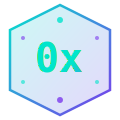

<p align="center">
  
</p>

<h1 align="center">0x</h1>

<p align="center">
  <strong>Write 18 lines. Get 96 lines of production React.</strong><br/>
  A programming language that compiles to React, Vue 3, and Svelte 5.
</p>

<p align="center">
  <a href="https://www.npmjs.com/package/0x-lang"></a>
  <a href="https://www.npmjs.com/package/0x-lang"></a>
  <a href="https://opensource.org/licenses/ISC"></a>
  <a href="https://smithery.ai/server/0x"></a>
</p>

<p align="center">
  <a href="https://0xlang.com">Website</a> · <a href="#quick-start">Quick Start</a> · <a href="#language-reference">Docs</a> · <a href="https://www.npmjs.com/package/0x-lang">npm</a> · <a href="mcp-server/">MCP Server</a> · <a href="https://server.smithery.ai/hankim/ox-lang">Smithery Server</a>
</p>

---

## What is this?

0x is a tiny language for building UI. You describe what you want, and the compiler outputs production-ready React, Vue, or Svelte.

```python
page Counter:
  state count: int = 0

  fn increment():
    count += 1

  layout col gap=16 padding=24 center:
    text "Counter" size=2xl bold
    text "{count}" size=4xl color=cyan
    button "+1" style=primary -> increment()
```

That's a complete component. Run `0x build counter.ai --target react` and you get a working React component with `useState`, event handlers, and full styling. Same source also compiles to Vue 3 and Svelte 5.

**Why?** Most frontend code is boilerplate — imports, hook calls, JSX wrappers, style objects, closing tags. 0x skips all of that. You write what matters, the compiler handles the rest.

## The numbers

| Component | 0x | React | You save |
|:---|:---:|:---:|:---:|
| Counter | 18 lines | 96 lines | **81%** |
| Todo App | 24 lines | 136 lines | **82%** |
| Dashboard | 37 lines | ~185 lines | **80%** |
| Chat App | 31 lines | ~155 lines | **80%** |
| E-commerce | 44 lines | ~210 lines | **79%** |

> Compared against production TypeScript React with full inline styling, types, and component structure.

## Quick Start

```bash
npm install -g 0x-lang
```

Create a file called `hello.ai`:

```python
page Hello:
  state name: str = "World"

  layout col gap=16 padding=24 center:
    text "Hello, {name}!" size=3xl bold
    input name placeholder="Your name"
```

Compile it:

```bash
# Pick your framework
0x build hello.ai --target react
0x build hello.ai --target vue
0x build hello.ai --target svelte

# Or all three at once
0x build hello.ai --target react,vue,svelte
```

### Scaffold a project

```bash
0x init my-app
cd my-app
0x build src/counter.ai --target react
```

### Watch mode

```bash
0x dev counter.ai --target react
```

File changes auto-recompile.

---

## Examples

### Todo App — 24 lines

```python
page Todo:
  type Item = {id: int, text: str, done: bool}

  state items: list[Item] = []
  state input: str = ""
  derived remaining = items.filter(i => !i.done).length

  fn add():
    if input.trim() != "":
      items.push({id: Date.now(), text: input, done: false})
      input = ""

  fn remove(id: int):
    items = items.filter(i => i.id != id)

  layout col gap=16 padding=24 maxWidth=600 margin=auto:
    text "Todo ({remaining} remaining)" size=2xl bold

    layout row gap=8:
      input input placeholder="What needs to be done?"
      button "Add" style=primary -> add()

    for item in items:
      layout row gap=8 center:
        toggle item.done
        text item.text strike={item.done}
        button "Delete" style=danger size=sm -> remove(item.id)

    if items.length == 0:
      text "Nothing to do" color=#999 center
```

Types, filtering, conditional rendering, two-way binding — all handled. Compiles to 136 lines of production React.

### Dashboard with API calls — 37 lines

```python
page Dashboard:
  type Metric = {label: str, value: float, change: float}

  state metrics: list[Metric] = []
  state period: str = "week"
  state loading: bool = true

  api getMetrics = GET "/api/metrics"

  on mount:
    metrics = await getMetrics(period: period)
    loading = false

  watch period:
    loading = true
    metrics = await getMetrics(period: period)
    loading = false

  layout col gap=24 padding=32:
    layout row between center:
      text "Dashboard" size=3xl bold
      select period options=["day", "week", "month", "year"]

    if loading:
      text "Loading..." center
    else:
      layout grid cols=3 gap=16:
        for metric in metrics:
          component MetricCard(metric)

component MetricCard:
  prop metric: Metric

  derived isPositive = metric.change >= 0
  derived changeColor = isPositive ? "green" : "red"

  layout col gap=8 padding=24 radius=12 shadow=md bg=white:
    text metric.label size=sm color=#666
    text "{metric.value}" size=2xl bold
    text "{isPositive ? '↑' : '↓'} {metric.change}%" size=sm color={changeColor}
```

Async data fetching, loading states, watchers, grid layouts, reusable child components.

### Chat App — 31 lines

```python
page Chat:
  type Message = {id: int, text: str, sender: str, time: datetime}

  state messages: list[Message] = []
  state input: str = ""
  state username: str = "Me"

  fn send():
    if input.trim() != "":
      messages.push({id: Date.now(), text: input, sender: username, time: now()})
      input = ""

  layout col height=100vh:
    layout row center padding=16 bg=#075e54:
      text "Chat" size=lg bold color=white

    layout col gap=8 padding=16 scroll=y grow=1:
      for msg in messages:
        layout row {msg.sender == username ? "end" : "start"}:
          layout col padding=12 radius=12 maxWidth="70%" bg={msg.sender == username ? "#dcf8c6" : "white"} shadow=sm:
            text msg.text
            text msg.time.format("HH:mm") size=xs color=#999 end

    layout row gap=8 padding=16 bg=#f0f0f0:
      input input placeholder="Type a message..." grow=1
      button "Send" style=primary -> send()
```

### E-commerce — 44 lines

```python
page Shop:
  type Product = {id: int, name: str, price: float, image: str}
  type CartItem = {product: Product, qty: int}

  state products: list[Product] = []
  state cart: list[CartItem] = []
  state search: str = ""
  state loading: bool = true

  derived filteredProducts = products.filter(p => p.name.includes(search))
  derived cartTotal = cart.reduce((sum, item) => sum + item.product.price * item.qty, 0)
  derived cartCount = cart.reduce((sum, item) => sum + item.qty, 0)

  api getProducts = GET "/api/products"

  on mount:
    products = await getProducts()
    loading = false

  fn addToCart(product: Product):
    existing = cart.find(item => item.product.id == product.id)
    if existing:
      existing.qty += 1
    else:
      cart.push({product: product, qty: 1})

  fn removeFromCart(productId: int):
    cart = cart.filter(item => item.product.id != productId)

  layout col gap=24 padding=32:
    layout row between center:
      text "Shop" size=3xl bold
      layout row gap=8 center:
        text "Cart ({cartCount})" size=lg
        text "${cartTotal}" size=lg bold color=#e74c3c

    input search placeholder="Search products..."

    if loading:
      text "Loading..." center
    else:
      layout grid cols=3 gap=16:
        for product in filteredProducts:
          layout col gap=8 padding=16 radius=12 shadow=md bg=white:
            image product.image width="100%" height=200
            text product.name size=lg bold
            text "${product.price}" size=md color=#e74c3c
            button "Add to Cart" style=primary -> addToCart(product)
```

More examples in [`examples/`](examples/).

---

## Language Reference

### Top-level declarations

```python
page PageName:              # Page component (has routing)
component ComponentName:    # Reusable component
app AppName:                # App root
```

### State

```python
state count: int = 0                    # Reactive state
state items: list[Item] = []            # Typed list
derived total = price * quantity         # Auto-computed
prop title: str = "Default"             # External prop
```

### Types

```python
type Item = {id: int, text: str, done: bool}
type User = {name: str, email: str, age: optional[int]}
```

Built-in: `int`, `float`, `str`, `bool`, `list[T]`, `optional[T]`, `datetime`, `object`

### Functions

```python
fn increment():
  count += 1

fn add(text: str):
  items.push({id: Date.now(), text: text, done: false})

async fn fetchData():
  data = await api.getData()
```

### Layout

```python
layout col gap=16 padding=24:        # Vertical (flexbox column)
layout row gap=8 center:              # Horizontal (flexbox row)
layout grid cols=3 gap=16:            # CSS Grid
```

Props: `gap`, `padding`, `margin`, `center`, `between`, `end`, `wrap`, `grow`, `maxWidth`, `bg`, `radius`, `shadow`, `scroll`

### UI Elements

```python
text "Hello" size=2xl bold color=#333           # Text
text "{variable}" size=lg                        # Dynamic text
button "Click" style=primary -> action()        # Button with handler
button "Set" -> count = 0                        # Inline mutation
input binding placeholder="Type..."             # Two-way binding
toggle binding                                   # Toggle switch
select binding options=["a", "b", "c"]          # Dropdown
image src width=100 height=100                   # Image
link "Click here" href="/path"                   # Link
```

### Styling

```python
text "Big" size=2xl bold color=blue              # Inline props
button "Go" style=primary size=lg rounded=full   # Presets

style card:                                       # Named style block
  padding: 24
  radius: 12
  shadow: md
  bg: white

layout col .card:                                 # Apply named style
  text "Inside a card"
```

Sizes: `xs`, `sm`, `md`, `lg`, `xl`, `2xl`, `3xl`, `4xl`<br/>
Button styles: `primary`, `secondary`, `danger`, `outline`, `ghost`

### Control flow

```python
if condition:
  text "True"
elif other:
  text "Other"
else:
  text "False"

for item in items:
  text item.name

show isVisible:                         # Show when true
hide isHidden:                          # Hide when true
```

### Lifecycle & Watchers

```python
on mount:
  data = await fetchData()

on destroy:
  cleanup()

watch selectedId:
  details = await fetchDetails(selectedId)
```

### API calls

```python
api getData = GET "/api/data"
api createItem = POST "/api/items"
api updateItem = PUT "/api/items/{id}"
api deleteItem = DELETE "/api/items/{id}"
```

### Validation

```python
check items.length <= 500 "Max 500 items"
check price >= 0 "Price must be positive"
```

### Events

```python
button "Save" -> save()                          # Click
button "Reset" -> count = 0                       # Inline
input query @keypress=onKeyPress                  # Keyboard
```

---

## Programmatic API

Use 0x as a library in your own tools:

```typescript
import { compile } from '0x-lang';

const source = `
page Hello:
  state name: str = "World"
  layout col:
    text "Hello, {name}!" size=2xl bold
`;

const react  = compile(source, { target: 'react' });
const vue    = compile(source, { target: 'vue' });
const svelte = compile(source, { target: 'svelte' });

console.log(react.code);       // Full React component
console.log(react.lineCount);  // Line count
```

### Pipeline access

```typescript
import { tokenize, parse, validate, generateReact } from '0x-lang';

const tokens = tokenize(source);     // Lexical tokens
const ast = parse(source);           // Abstract syntax tree
const result = validate(ast);        // Errors & warnings
const output = generateReact(ast);   // React JSX string
```

### Exports

| Import path | What you get |
|:---|:---|
| `0x-lang` | Everything — compile, parse, tokenize, validate, generators |
| `0x-lang/compiler` | `compile()` only |
| `0x-lang/tokenizer` | `tokenize()` only |
| `0x-lang/parser` | `parse()` only |
| `0x-lang/validator` | `validate()` only |
| `0x-lang/generators/react` | `generateReact()` |
| `0x-lang/generators/vue` | `generateVue()` |
| `0x-lang/generators/svelte` | `generateSvelte()` |

---

## MCP Server

0x has a built-in MCP server so AI tools can compile 0x directly. The AI writes compact 0x internally and returns production framework code — the user never touches 0x.

### Setup

<details>
<summary><strong>Claude Desktop</strong></summary>

Add to `~/Library/Application Support/Claude/claude_desktop_config.json`:

```json
{
  "mcpServers": {
    "0x": {
      "command": "npx",
      "args": ["-y", "0x-lang-mcp-server"]
    }
  }
}
```

</details>

<details>
<summary><strong>Cursor</strong></summary>

Add to `.cursor/mcp.json`:

```json
{
  "mcpServers": {
    "0x": {
      "command": "npx",
      "args": ["-y", "0x-lang-mcp-server"]
    }
  }
}
```

</details>

<details>
<summary><strong>Smithery</strong></summary>

```bash
npx @smithery/cli install 0x
```

Or use the hosted server directly: https://server.smithery.ai/hankim/ox-lang

</details>

### Tools

| Tool | What it does |
|:---|:---|
| `0x_compile` | Compile 0x source → React / Vue / Svelte |
| `0x_reference` | Get the full syntax reference |
| `0x_examples` | Browse example code (counter, todo, chat, dashboard, ecommerce) |

### How it works

```
You:  "Build me a todo app in React"
AI:   [0x_reference] → writes 30 lines of 0x → [0x_compile] → 140 lines of React
You:  Gets a working React component
```

The AI generates ~30 lines of 0x internally. The compiler outputs ~140 lines of production code. Fewer tokens generated, fewer mistakes made, better results delivered.

See [mcp-server/](mcp-server/) for full docs.

---

## For AI agent builders

If you're building tools that generate UI code, 0x works well as an intermediate representation:

```typescript
import { compile } from '0x-lang/compiler';

// Your AI generates compact 0x
const aiOutput = `
page Dashboard:
  state metrics: list[object] = []

  on mount:
    metrics = await api.getMetrics()

  layout col gap=24 padding=32:
    text "Dashboard" size=3xl bold
    layout grid cols=3 gap=16:
      for metric in metrics:
        layout col padding=20 bg=white rounded=lg shadow:
          text "{metric.label}" size=sm color=gray
          text "{metric.value}" size=2xl bold
`;

// Compile to whatever the user needs
const react  = compile(aiOutput, { target: 'react' });
const vue    = compile(aiOutput, { target: 'vue' });
const svelte = compile(aiOutput, { target: 'svelte' });
```

Why this matters for AI:

- **80% fewer output tokens** — less generation cost, lower latency
- **One syntax, zero decisions** — no "which React pattern?" hallucinations
- **Multi-framework** — one generation covers React, Vue, and Svelte users
- **Deterministic** — same input always produces the same output
- **Validated** — the compiler catches errors before they reach the user

---

## Architecture

```
Source (.ai)
    ↓
Tokenizer ─── Indentation-aware lexical analysis
    ↓
Parser ────── Recursive descent → typed AST
    ↓
Validator ─── Circular deps · unused state · type checks
    ↓
Generator
    ├── React ─── JSX + hooks + CSS-in-JS
    ├── Vue ───── SFC + Composition API + scoped styles
    └── Svelte ── Runes ($state, $derived) + styles
```

~9,800 lines of TypeScript. Zero runtime dependencies.

| Module | Lines | |
|:---|---:|:---|
| Parser | 3,560 | Recursive descent, full AST |
| React Generator | 2,423 | JSX + hooks + memo + styling |
| AST Types | 1,065 | TypeScript definitions |
| Vue Generator | 822 | SFC with `<script setup>` and `ref()` |
| Svelte Generator | 743 | Svelte 5 with `$state()` and `$derived()` |
| Validator | 355 | Static analysis + error reporting |
| Tokenizer | 348 | Indentation-aware lexer |
| CLI | 223 | build · dev · bench · init |

## CLI

```
0x build <file.ai> --target <target> [--output <dir>]
0x dev <file.ai> --target <target>
0x bench <file.ai>
0x init [project-name]

Flags:
  --target, -t    react, vue, svelte (comma-separated)
  --output, -o    Output directory (default: ./dist/)
  --help, -h      Show help
```

## Contributing

```bash
git clone https://github.com/hankimis/0x-lang.git
cd 0x-lang
npm install
npm test          # 2,600+ lines of tests
npm run build
```

Tests cover tokenizer, parser, validator, all three generators, benchmarks, and integration. See [CONTRIBUTING.md](CONTRIBUTING.md).

## License

[ISC](LICENSE) — free for everything.

---

<p align="center">
  <a href="https://0xlang.com">0xlang.com</a> · <a href="https://github.com/hankimis/0x-lang">GitHub</a> · <a href="https://www.npmjs.com/package/0x-lang">npm</a> · <a href="https://smithery.ai/server/0x">Smithery</a> · <a href="https://server.smithery.ai/hankim/ox-lang">Smithery Server</a>
</p>
